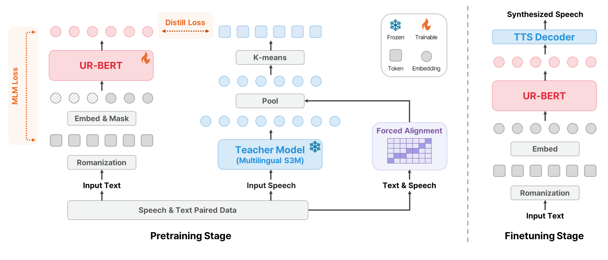

# UR-BERT

Codebase for the Interspeech 2026 paper:
**UR-BERT: Scaling Text Encoders for Massively Multilingual TTS Through Universal Romanization and Speech Token Prediction**.

This repository contains two main stages:

- **Pretraining**: Train UR-BERT with MLM / MLM+distillation objectives.
- **Finetuning**: Finetune VITS-based multilingual TTS models using PLBERT, XPhoneBERT, UR-BERT, or VITS baseline.

## Abstract



We propose UR-BERT, a Romanized transcription-based text-to-speech (TTS) encoder for massively multilingual TTS systems. Conventional grapheme-to-phoneme (G2P)-based approaches are limited to around 100 languages due to the availability of reliable G2P resources. In contrast, UR-BERT scales to 495 languages by unifying diverse writing systems into a shared Romanization representation.
To further enhance phonetic fidelity and text–speech alignment, we introduce a speech token prediction objective during training, which encourages the encoder to learn speech-aware phonetic representations in a data-efficient manner.
Experiments show that TTS systems built on UR-BERT consistently outperform recent text encoder baselines across a wide range of languages and resource conditions, and demonstrate strong generalization to unseen languages.


## Repository Structure

```text
urbert/
├── pretraining/                      # UR-BERT language-model pretraining
│   ├── configs/
│   ├── preprocessing/
│   ├── train.py
│   └── README.md
├── finetuning/                       # VITS-based multilingual TTS finetuning
│   ├── configs/
│   ├── data/
│   ├── train.py
│   ├── inference.py
│   └── README.md
└── README.md
```

## 1) Quick Start (Using Hugging Face)

The exported UR-BERT backbone is available on Hugging Face:

- Model repo: [Sanghyang00/urbert-256](https://huggingface.co/Sanghyang00/urbert-256)
- Model card: `pretraining/README.md` (or the README in the HF model repository)

Quick usage:

```python
import torch
from transformers import AutoModel, AutoTokenizer

REPO_ID = "Sanghyang00/urbert-256"
device = "cuda" if torch.cuda.is_available() else "cpu"

tokenizer = AutoTokenizer.from_pretrained(REPO_ID, force_download=True)
model = AutoModel.from_pretrained(REPO_ID).to(device).eval()

text = "hello urbert"
inputs = tokenizer(text, add_special_tokens=False, return_tensors="pt")
inputs = {k: v.to(device) for k, v in inputs.items()}

with torch.no_grad():
    outputs = model(**inputs)
    last_hidden = outputs.last_hidden_state

print("input_ids:", inputs["input_ids"].tolist())
print("input shape:", tuple(inputs["input_ids"].shape))
print("last_hidden shape:", tuple(last_hidden.shape))
```

Notes for tokenizer behavior:

- The HF tokenizer is character-level and `AutoTokenizer`-compatible.
- Special token strings (e.g., `"[MASK]"`) follow HF special-token handling.

## 2) Pretraining

Go to:

```bash
cd /ssd/sangmin/urbert/pretraining
```

Install dependencies:

```bash
pip install -r requirements.txt
```

Run training:

```bash
CUDA_VISIBLE_DEVICES=0 python train.py \
  --config configs/urbert_MLM.yaml \
  --exp_name urbert_MLM \
  --resume None
```

Or MLM + distillation:

```bash
CUDA_VISIBLE_DEVICES=0 python train.py \
  --config configs/urbert_MLM_distill.yaml \
  --exp_name urbert_MLM_distill \
  --resume None
```

See details in `pretraining/README.md`.

## 3) Finetuning (TTS)

Go to:

```bash
cd /ssd/sangmin/urbert/finetuning
```

Install dependencies:

```bash
pip install -r requirements.txt
```

Run finetuning (example: UR-BERT encoder):

```bash
CUDA_VISIBLE_DEVICES=0 python train.py \
  --bert_type urbert \
  --config configs/urbert/english.json \
  --experiment_name urbert-english
```

Run inference:

```bash
CUDA_VISIBLE_DEVICES=0 python inference.py \
  --logs_dir logs \
  --output_dir outputs \
  --target_experiments urbert-english \
  --device cuda
```

See details in `finetuning/README.md`.

## Notes

- The Hugging Face export currently provides the UR-BERT backbone encoder.
- For training details and preprocessing pipelines, see `pretraining/README.md`.
- Config files under each `configs/` directory are the source of truth for language- and experiment-specific settings.
